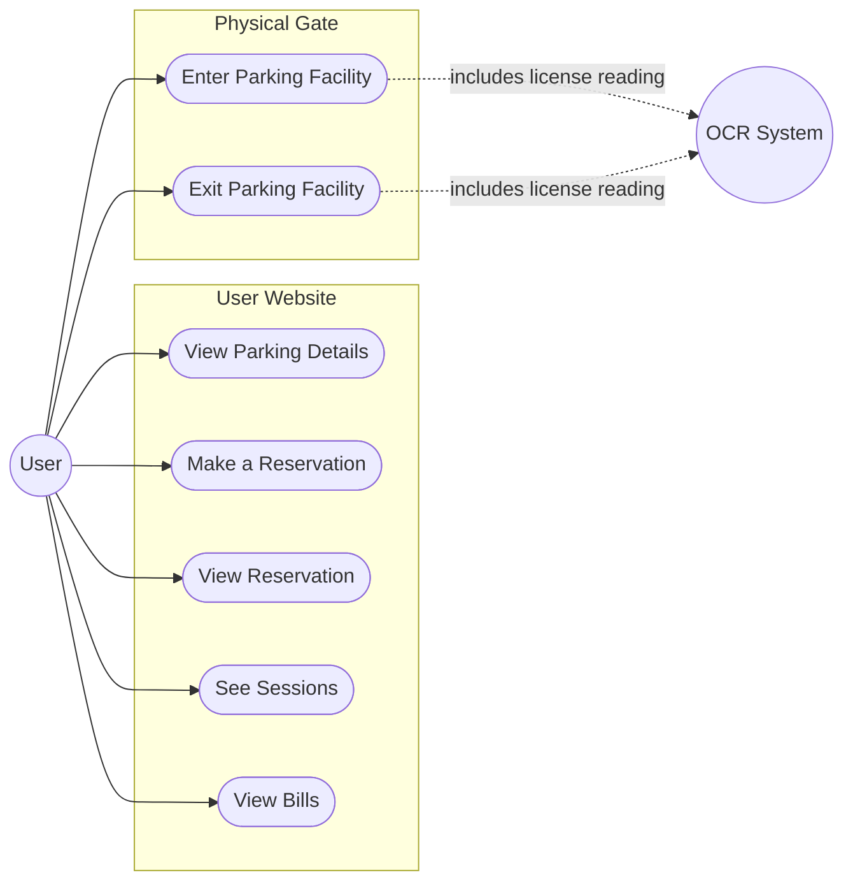
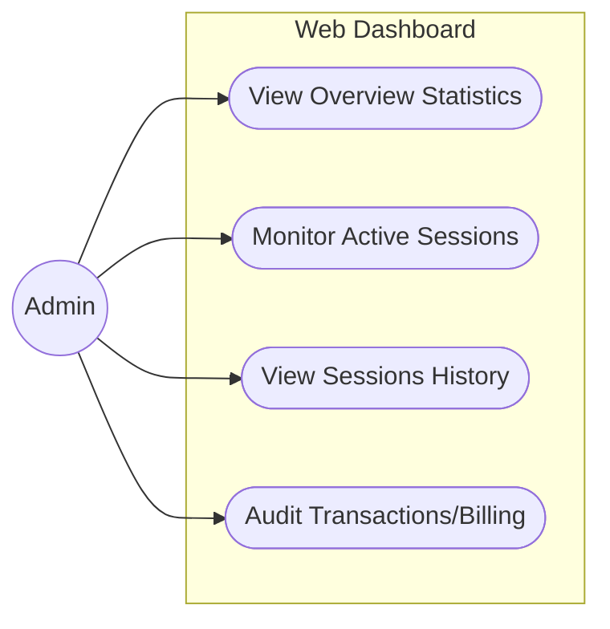

# Smart Parking System: Use Case Diagrams

This document outlines the primary use cases for the **User** and **Admin** actors within the Smart Parking System.

## 1. User Use Case Diagram

The **User** interacts with the system primarily through a web application and physically at the parking gate.

### Detailed User Actions:
- **View Parking Details**: Check information about the parking facility, rates, and operating hours.
- **Make a Reservation**: Book a spot in advance. The user receives a one-time code as a fallback if OCR fails.
- **View Reservation**: Check specifics about current or upcoming reservations.
- **See Sessions**: Review past and currently active parking durations.
- **View Bills**: Access and settle the financial charges calculated from parking sessions.
- **Enter Parking Facility**: Physically arrive at the entry gate. System grants access automatically via the ESP32-CAM License Plate Recognition (OCR) or manually using the fallback one-time code.
- **Exit Parking Facility**: Leave the parking lot. The exit ESP32-CAM reads the plate to authorize departure.

---

## 2. Admin Use Case Diagram

The **Admin** monitors and audits the system operations predominantly via a web dashboard UI.

### Detailed Admin Actions:
- **View Overview Statistics**: Access a high-level summary that tracks overarching system availability, revenue, and active capacity trends.
- **Monitor Active Sessions**: Actively track all vehicles currently parked in the facility with live duration information.
- **View Sessions History**: Audit logs for previously completed parking durations, including plate data.
- **Audit Transactions/Billing**: Access financial transaction logs, viewing precisely what was charged based on the pricing engine.
